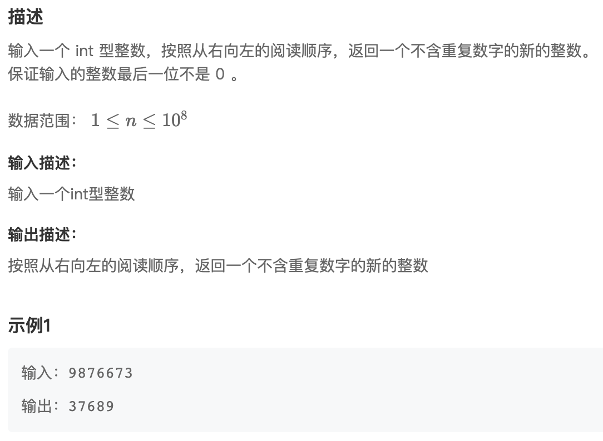
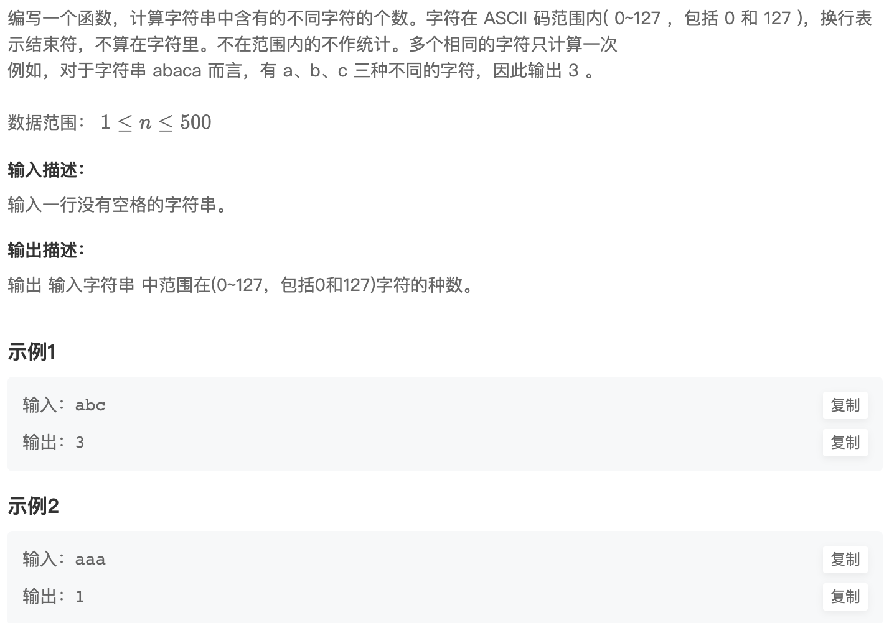
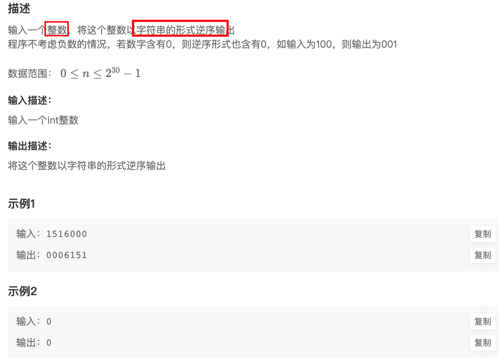
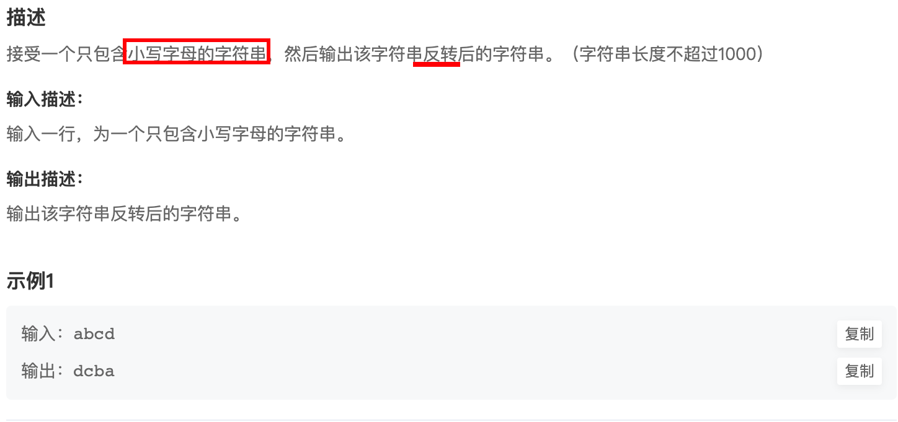
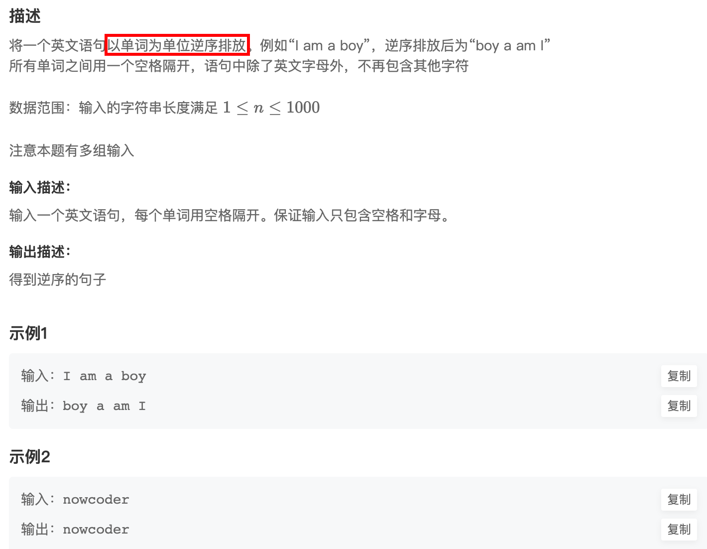
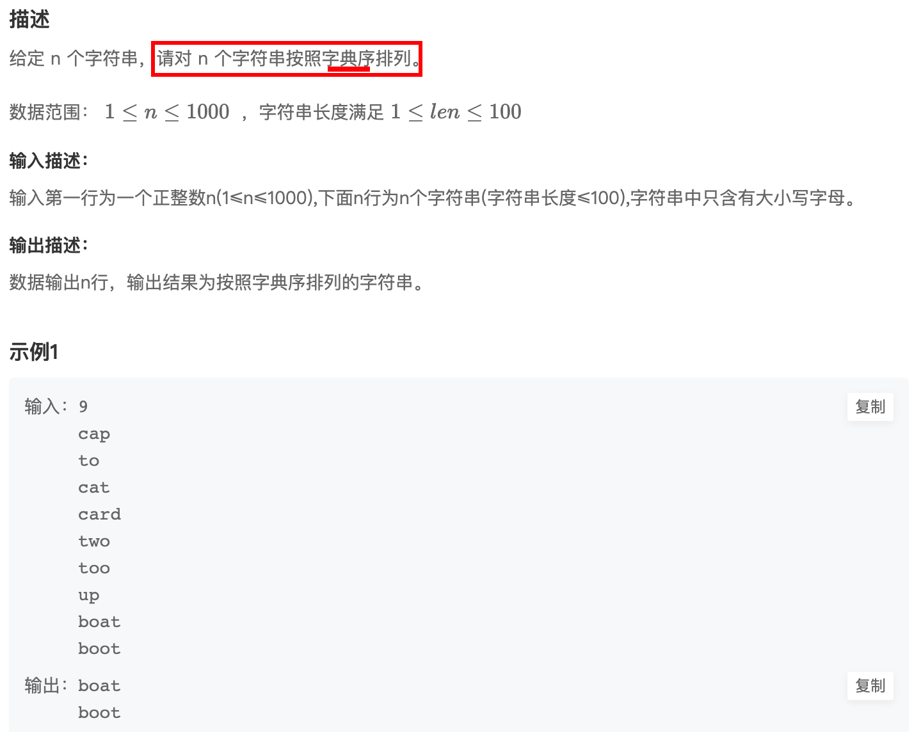
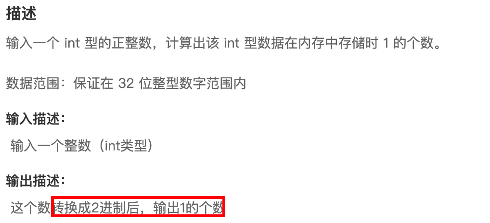

来源：[华为机试](https://www.nowcoder.com/exam/oj/ta?page=1&tpId=37&type=37)


# HJ1


> [!NOTE]
>
> **字符串最后一个单词的长度**
>
> string｜字符串匹配｜


+ cin：接受一个数字、字符、字符串。
  遇 空格、TAB、回车 结束
+ cin.getline()：接受一个字符串，可以接受空格
  + ***\*cin.getline(接收字符串的变量,接收字符个数,结束字符)\****
  + 三个参数省略时，系统默认为'\0'
+ getline()：接受字符串，可接受空格
  + 需要包含`#include<string>`

【注意】⚠️

1. cin，cin.getline属于istream流；getline属于string
2. 同时使用cin、getline()时。需要将回车符作为输入流cin以清除缓存


举例：<u>同时使用cin与getline()</u>

++错误演示

```C++
string input;
cin>>input;					//hu
cout<<input<<endl;	//hu
getline(cin,input);	//zi
cout<<input<<endl;	//
```

++正确做法

```C++
cin >> input;
cout << input << endl;

// cin与getline同时使用，需要清除缓存
input = "\n";
getline(cin, input);

getline(cin, input);
cout << input << endl;
```


----

# HJ2
> [!NOTE]
>
> 计算某字符出现次数不区分大小写
>
> + 字符串、字符识别，考虑大小写
> + 在此例子中，主要掌握字符大小变


+ tolower，将字符转换为小写

`int tolower(int c);`

`toupper()` 变为大写


+ 遍历对象

```C++
for (char ch_x:input) {
    if(ch== tolower(ch_x))
        num++;
}
```


# HJ3

> [!NOTE] 
>
> 明明的随机数
>
> 删除重复数字｜排序


[桶排序思想实现](./HJ3_2.cpp)


# HJ5

> [!NOTE]
>
> 进制转换｜<cmath>中pow ｜switch

`pow()`

[code](./HJ5.cpp)


# HJ9 提取不重复的整数




# HJ10 字符个数统计

> [!NOTE]
>
> 利用桶排序思想，统计是否出现。




# **HJ11** 数字颠倒

> [!NOTE]
>
> String 定义后可以`str.push_back`




# **HJ12** 字符串反转


> [!NOTE]
> 利用`str.size()`反向便利字符串输出




# **HJ13** 句子逆序

> [!NOTE]
>
> 两层循环
>
> + 大循环遍历整个str
> + 小循环遍历单个单词
>   + 通过左右指针来控制单个单词输出



# **HJ14** 字符串排序

> [!NOTE]
>
> 1. 如何对STL容器排序 sort
> 2. transform，定义在`<algorithm>`。
>    用于对指定范围内的元素应用给定的操作，并将结果存储到另一个范围中
>    详细解析在下面
> 3. 迭代器
>    1. 迭代器（iterator）是 C++ 标准库中的一种重要概念，用于对容器中的元素进行遍历和访问。迭代器类似于指针，可以指向容器中的某个元素，并支持对元素进行访问、修改和移动等操作。
>    2. 总的来说，迭代器是 C++ 中用来对容器进行访问和操作的一种机制，它允许我们<u>以统一的方式遍历和操作容器中的元素</u>，而不需要关心容器的具体类型和实现细节。




解析：

```C++
bool cmp(string a,string b){
    string a_lower, b_lower;
    // 将字符串转换为小写
    transform(a.begin(), a.end(), back_inserter(a_lower), [](unsigned char c){ return tolower(c); });
    transform(b.begin(), b.end(), back_inserter(b_lower), [](unsigned char c){ return tolower(c); });
    return a< b;
}
```

1. `transform` 函数用于对指定范围内的元素应用给定的操作，并将结果存储到另一个范围中。它接受四个参数：
   - 第一个参数是指定范围的起始位置（迭代器）。
   - 第二个参数是指定范围的结束位置（迭代器）。
   - 第三个参数是存储结果的起始位置（迭代器）。
   - 第四个参数是一个函数对象，用于指定操作。这个函数对象可以是一个函数指针、函数对象、或者 lambda 表达式。
2. 在这行代码中，`transform` 函数将字符串 `a` 中的每个字符应用给定的操作，然后将结果存储到新创建的字符串 `a_lower` 中。
3. `a.begin()` 和 `a.end()` 分别指定了字符串 `a` 的起始位置和结束位置，这样 `transform` 函数就会对整个字符串进行操作。
4. `back_inserter(a_lower)` 是一个迭代器，它用于在容器末尾插入新的元素。在这里，我们使用 `back_inserter` 函数创建了一个用于插入字符的迭代器，并将其传递给 `transform` 函数，以便将结果存储到新的字符串 `a_lower` 中。
5. `[](unsigned char c){ return tolower(c); }` 是一个 lambda 表达式，它接受一个 `unsigned char` 类型的参数，并将其转换为小写字母。这个 lambda 表达式是我们在 `transform` 函数中指定的操作，用于对每个字符执行转换操作。


# **HJ15** 求int型正整数在内存中存储时1的个数

> [!NOTE]
>
> 1. 求摸取余
> 2. 位操作





